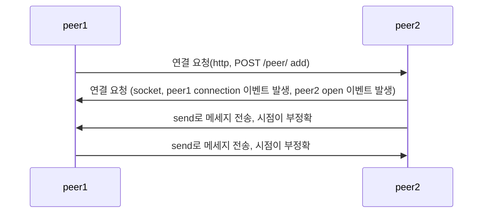

# P2P

- 소켓 통신을 사용해서 Peer to Peer를 구현한다.

# 연결 방법

# socket.io VS ws(WebSocket)

- WebSocket : 웹 기반의 소켓 시스템
  -> 브라우저와 서버 사이에 소켓 통신을 하기 위한 기술

- Socket.io : WebSocket을 기반으로 구현된 라이브러리
  -> WebSocket 에 비해서 무겁지만 각종 편의 기능을 제공한다. (room)

| Web Socket                    | socket.io                                       |
| ----------------------------- | ----------------------------------------------- |
|                               |
| HTML5 웹 표준기술             | 표준이 아닌 단순 라이브러리                     |
| 빠르고 데이터 사용이 간결하다 | 느리지만 연결이 끊겼을 시 계속 연결을 시도한다. |
| 단순 전송                     | 방, 연결 실패 시 지속 연결 기능 등 제공         |

-블록체인에서 방 필요없고 계속 연결 확인할 필요가 없으니 websocket을 사용한다.
