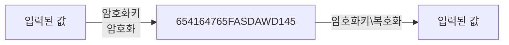
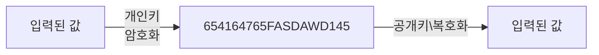
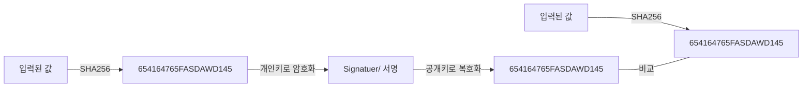

# 암호화

- 블록체인에서 누가 했는지, 즉 신원을 확인하기 위해 양방향 암호화를 사용한다.
- 지금까지 다룬 Hash(Sha256) 은 단방향으로 복호화가 불가능하다.

# 비대칭 암호화

- 대칭 vs 비대칭
- 대칭 암호화

암호화할 때와 복호화할 때 같은 키를 사용한다.

- 비대칭 암호화

개인키는 안전하게 보관할 수 있으며 암호문과 공개키를 상대에게 공유함으로써 데이터를 확인할 수 있다.
공개키로 복호화할 수 있는 암호문은 연결된 개인키로 생성한 암호문뿐이어야한다.

- 블록체인에서 암호화

# 타원곡선

- 암호화 알고리즘 중 하나(ECC, elliptic curve cryptography)
- 개인키와 공개키를 만들기 위해서 사용한다.
- RSA를 안쓰고 이 방식을 사용하는 이유

  -

- 타원곡선에서 사용하는 함수
  -y^2 = x^3 + ax + b

  - 비트코인, 이더리움은 y^2 = x^3 + 7

- 타원곡선에서의 덧셈 규칙

  - P + Q + R = 0;

- 개인키(k)

  - 임의의 점 P를 더하여 새로운 점을 찾은 횟수

- 공개키(kp)

  - P를 K번 더해서 찾은 점

- 기준점(G)

  - 이더리움과 비트코인에서 공개키를 구하기 위해 사용하는 점
  - 02 79BE667E F9DCBBAC 55A06295 CE870B07 029BFCDB 2DCE28D9 59F2815B 16F81798 << 실제로 사용하는 것

- 개인키(k)가 너무 크기에 계산에 있어서 알고리즘을 사용한다.
  - Double-and-Add 알고리즘을 사용한다.
  - 횟수를 2진수로 표기 후 0 또는 1을 더하도록 처리한다.
  - 35 횟수를 예시로 아래의 순서로 진행
    1. 35 = 2진수로 100011 (왼쪽부터 읽는다.)
    2. 첫 자리의 1부터 시작하여 G를 더한다 => 0 \* 2 + G = G
    3. 두번째 자리는 0이기 때문에 G \* 2 = 2G
    4. 세번째 자리는 0이기 때문에 2G \* 2 = 4G
    5. 네번째 자리는 0이기 때문에 4G \* 2 = 8G
    6. 다섯번째 자리는 1이기 때문에 8G \* 2 + G = 17G
    7. 여섯번째 자리는 1이기 때문에 17G \* 2 + G = 35G
    - 공식으로 보자면 "이전값 \* 2 + 2진수자리(0또는 1) \* G"
    - 개인키가 16진수로 된 64자리의 수 => 16^64 -> 이만한 횟수가 256번으로 끝난다.

# 지갑

- 지갑에서 계정을 생성할 경우 개인키와 공개키를 생성한다.
- 공개키를 사용해서 지갑 주소를 만든다.
- 비트코인
  - 암호화를 여러 번 거친 후에 사용한다.
- 이더리움
  - 뒤에서부터 40자만 사용한다.
