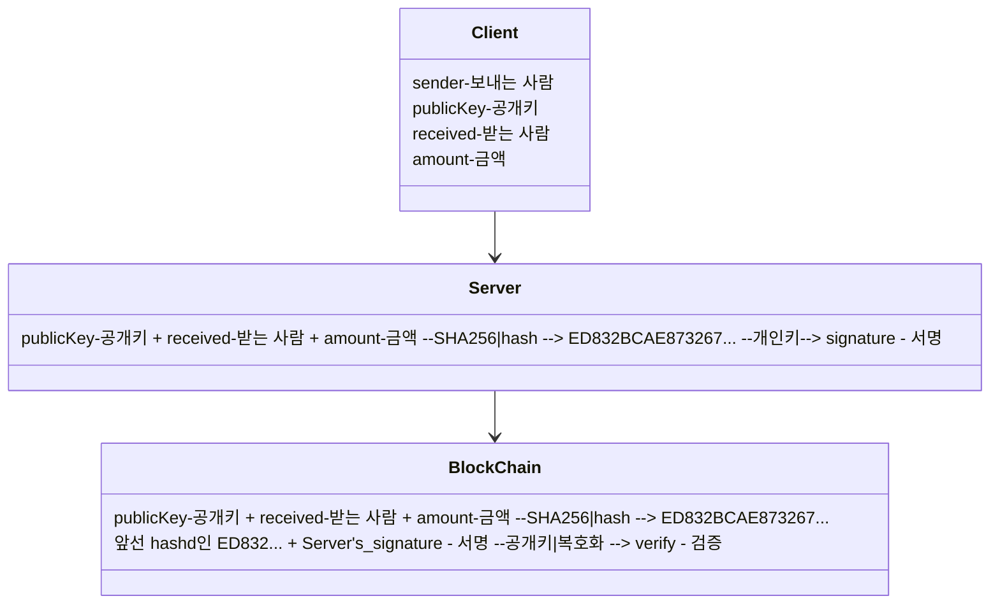

# 지갑 서버

- 보안때문에 아무나 블록체인에 블록이나 트랜잭션을 추가할 수 없도록 하기 위해 중간 서버를 만들어 거치게 한다.

```mermaid
  classDiagram
  Client --> Server
  Server --> BlockChain
  class Client{
    sender-보내는 사람
    publicKey-공개키
    received-받는 사람
    amount-금액
  }
  class Server{
    publicKey-공개키 + received-받는 사람 + amount-금액 --SHA256|hash --> ED832BCAE873267... --개인키--> signature - 서명
  }
  class BlockChain{
    publicKey-공개키 + received-받는 사람 + amount-금액 --SHA256|hash --> ED832BCAE873267...
    앞선 hashd인 ED832... + Server's_signature - 서명 --공개키|복호화 --> verify - 검증
  }
```
