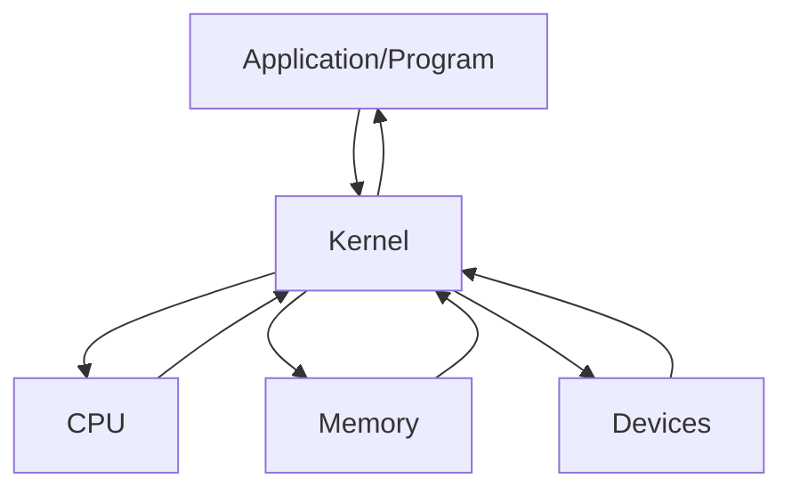

# VM

- Virtual Machine의 약자
- OS 내에서 다른 OS를 설치, 실행하는 프로그램
- LPPlayer 등을 포함하는 안드로이드 플레이어, Java에서 사용하는 JVM, Ethereum 에서 사용하는 EVM, Windows/Linux/Android 등 거의 모든 os를 설치할 수 있는 VMWare 등이 있다.
- 단점으로는 물리적인 컴퓨터, 즉 하드웨어의 성능을 본래의 os와 나누게 되므로 성능 저하를 일으킨다.

# Kernel

- 커널이란 하드웨어와 프로그램을 연결해주는 프로그램이다.
- OS에 포함되어 있다.



# WSL

- Windows SubSystem for Linux
- 윈도우에서 Linux OS를 사용하게 해주는 서비스
- Linux OS에는 ubuntu, cent Os, Redhat 등이 있다.
  - Linux : Unix 기반의 OS이다.
  - Mac OS도 Unix 기반의 OS이다.
- WSL과 VM은 조금 다르다 -> VM이 OS상에서 다른 OS를 설치, 사용하므로 하드웨어의 성능을 나눠서 사용하지만 WSL은 Linux의 기반을 설치하지 않고 winsows의 기반을 사용하여 Linux를 실행한다. -> Linux의 커널을 사용하지 않는다.

# 설치

- 기초 확인 사항

  1.  윈도우 버전이 20H1 이상일 때 사용 가능.

- 순서

1. 제어판 -> 프로그램 추가/제거 -> windows기능 켜기/끄기 -> Linux용 windows 하위 시스템 체크

2. Microsoft Store에서 terminal 설치

- PowerShell과 같은 걸로 나온다.
- WSL 사용에 있어서 teminal을 권장한다.

3. terminal에서 아래의 명령어를 입력

```sh
dism.exe /online /enable-feature /featurename:Microsoft-Windows-Subsystem-Linux /all /norestart
```

-배포이미지 관리

```sh
dism.exe /online /enable-feature /featurename:VirtualMachinePlatform /all /norestart
```

- 가상 미션 활성화

4. 아래의 명령어로 설치 가능한 Linux os를 확인할 수 있다.

```sh
wsl --list --online
```

5. 우분투 설치

```sh
wsl --install --d Ubuntu
```

6. Enter new Unix username

- 사용자 이름 입력

7. WSL2를 사용하기 위해 아래 프로그램 설치

8. WSL의 버전을 확인하기 위해 아래의 명령어 사용

```sh
wsl -l -v
```

9. WSL 2 버전 사용하기

```sh
wsl --set-version Ubuntu 2
```

10. 터미널에서 우분투 열기

```sh
wsl
```

- 나갈때는 exit

11. WSL 에서 삭제하고 싶을 때

```sh
wsl --unregister Ubuntu
```

12. 기본적으로 WSL2를 사용하도록 설정

```sh
wsl --set-default-version 2
```

# 기본적인 명령어들

- cd
  - 폴더이동
  - / : Root 경로 (최상위 경로)
  - ~ : Home 경로 (/home/사용자 이름)
- pwd
  - 현재 경로 출력
- ls
  - 현재 폴더의 내용을 출력
  - 옵션으로 대표적으로 a와 l을 사용
  - ls -al : 권한 용량 등 모든 파일/폴더를 출력(숨긴 파일 포함)

-mkdir -폴더 생성

- clear -화면 초기화
- curl -인터넷 접근(요청)

# Node.js

- 설치

```sh
sudo apt-get update
sudo apt-get upgrade
sudo apt-get install nodejs
```

- Ubuntu에서 Node.js는 최신 버전으로 설치되지 않는다. -해결은 nvm을 사용한다.
  -nvm : Node Version Manager

  - 설치 : curl -o- https://raw.githubusercontent.com/nvm-sh/nvm/v0.39.3/install.sh | bash

- nvm의 명령어들
  -nvm ls-remote : 설치 가능한 Node.js의 모든 버전을 보여준다.
  -nvm ls : 현재 설치된 Node.js version을 보여준다. -> 여러 버전을 설치 후에 선택하여 사용할 수 있다.
  -nvm use 18.12.1 : 18.12.1 버전을 사용한다.
